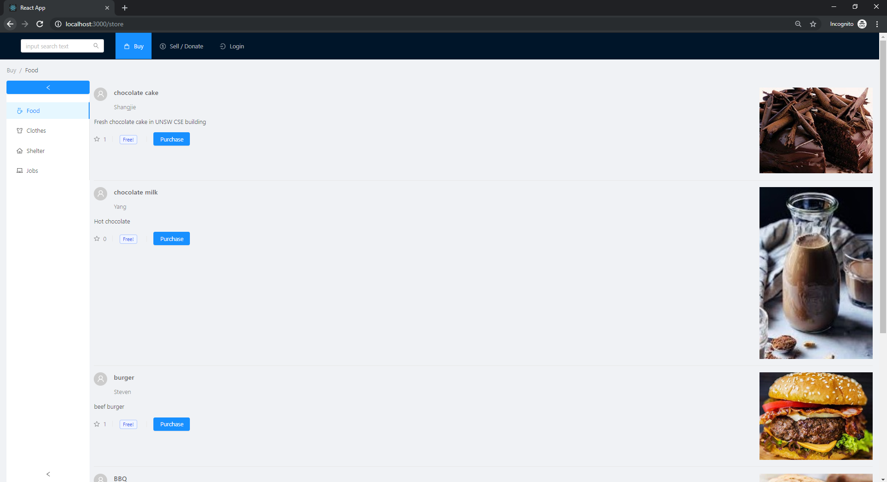

# chibaba
Welcome to _chibaba_. A marketplace design to donate or sell items that you don't use to public 
We created this project in July 2018, competing in [CSESoc Hackathon](https://github.com/csesoc/hackathon-resources)

## Abstract

These facts are taken from the World Food Program USA: 
* Approximately $1 trillion of food is lost or wasted every year.
* The world produces enough food to nourish every person on the planet, but one third of all food produce is spoiled before it can be consumed!

Takling these issues, we created a marketplace that is designed to make the world a better place by allowing users to donate excessive food to the public. Through that, we will allow users and people in poverty to receive those food from them.

## Achievement
Spending just under 24 hours, we created a prototype that:

* Allow user to register and login with their account
* Allow user to auction a product of their choice with photos
* Allow user to buy things using the points they acquire from donating

We use python and sqlite as backend and react as frontend. Checkout the project [here](http://ec2-18-222-212-185.us-east-2.compute.amazonaws.com/chibaba)
